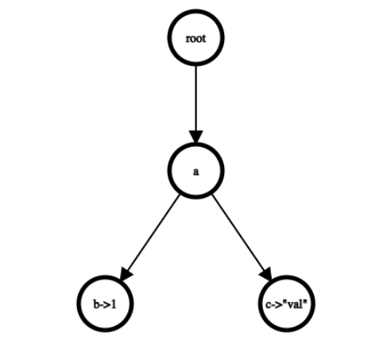

### 概览

需要实现一个数据结构为Trie树的kv存储，Trie一种高效的有序树数据结构，用于检索给定键的值。Trie中的每个节点存储一个key的单个字符，并且可以很多字节点，子节点代表key的下一个字符。key的末尾字符的节点(终端节点)会用一个flag标记这是一个key的结束，并存储相应的val。

下面这个Trie树，有ab->1,ac->“val”，两个kv对，注意val可以是任何类型。



### 实现

#### TrieNode

TrieNode类代表树中的单个节点，代表一个key中的单个char。一个TrieNode可以有很多子节点，因此用unordered_map来存储每个子节点的字符和子节点指针的映射。此外还需要一个flag来表示该节点是否是一个key的结尾。为了避免内存泄露，采用智能指针。

#### TrieNodeWithValue

该类代表一个key的终端节点，它继承了TrieNode，并且增加了自己特有的属性，即需要存储的val.

可以有两种方式来创建终端节点：

1. 插入一个key，创建一个新的终端节点。
2. 插入一个key，将非终端节点转换为终端节点，即将TrieNode转为TrieNodeWithValue。因此需要给该类实现一个TrieNodeWithValue(TrieNode &&trieNode, T value)有参构造，用于将已有的非终端节点转为终端节点，这个构造需要去调用TrieNode的移动构造将trieNode的资源转移到终端节点，包括表示的字符和子节点map。

#### Trie

成员变量有root节点的指针，指向一个根节点(用字符‘\0’标识)；为了支持并发，还需要一个读写锁 ReaderWriterLatch latch_

需要实现增删查三个功能

##### Insert

插入一个kv对到Trie中，一个key的每个字符都是一个节点，因此需要做的就是从root节点开始，一层一层的插入新节点，如果有该字符的节点了，我们应该重用它。key最后一个字符需要特殊处理，而不是直接在父节点中插入新节点。

需要判断是否该结尾字符已经在Trie树中，如果是，再判断这个节点是不是一个终端节点，如果是终端节点，则插入失败，因为不支持重复的key，如果不是终端节点，则需要将非终端的TrieNode转为终端节点TrieNodeWithValue。

如果结尾字符不在Trie树中，创建新的TrieNodeWithValue，然后插入到父节点中，插入完成。

同时在Insert操作中，应该是上写锁，返回时应该解锁。

##### Remove

移除给定key的val，同时需要删除一些没用节点。首先是根据这个key从root开始一层一层遍历，找到该key的终端节点，没有该key对应的终端节点则直接返回false。找到终端节点后，将其flag设为false，表示这不是一个终端节点，逻辑上删除这个kv。下一步我们需要从该节点开始向上递归的删除那些没有任何子节点的非终端节点，因为这些节点肯定是不再会被用到的，既不是一个key的结尾，也不是一个key的中间节点。实现上可以通过从root开始将遍历到该节点的路径保存，然后在路径中从后往前遍历每个节点，判断是否属于这种情况，是则在其父节点的map中移除。

同样的在Remove操作中，应该是上写锁，返回时应该解锁。

##### GetValue

返回指定key对应的val，注意这个val的类型是任意的，所以这是一个函数模板。还是首先从根节点开始一层一层遍历key的每个字符找到最后一个字符所在的节点，然后不是终端节点或者没有该节点，失败直接返回。有这个key所对应的终端节点，那么返回这个终端节点的val。这样就ok了吗？其实不是，由于val是任意类型的，所以还需要判断这个val是不是我们所要的val类型。要检查这两个类型是否相同，将终端 TrieNode 通过dynamic_cast转为 TrieNodeWithValue<T>。 如果转换结果不是 nullptr，则类型 T 是正确的类型。在类型不匹配时，即使有key所对应的终端节点，也应该失败直接返回。只有在类型匹配时，才正确返回其val。

同样的在GetValue操作中，应该是上读锁，返回时应该解锁。

#### ReaderWriterLatch

在c++中可以通过std::shared_mutex mutex_很容易得实现一个读写锁。在bustub中已经有一个实现好的读写锁，上写锁`mutex_.lock()` ,上读锁`mutex_.lock_shared()`,对应的解锁操作分别是：`mutex_.unlock()` 和`mutex_.unlock_shared()`。

#### 源码

```c++
//===----------------------------------------------------------------------===//
//
//                         BusTub
//
// p0_trie.h
//
// Identification: src/include/primer/p0_trie.h
//
// Copyright (c) 2015-2022, Carnegie Mellon University Database Group
//
//===----------------------------------------------------------------------===//

#pragma once

#include <memory>
#include <stdexcept>
#include <string>
#include <unordered_map>
#include <utility>
#include <vector>

#include "common/exception.h"
#include "common/rwlatch.h"

namespace bustub {

/**
 * TrieNode is a generic container for any node in Trie.
 */
class TrieNode {
 public:
  /**
   * TODO(P0): Add implementation
   *
   * @brief Construct a new Trie Node object with the given key char.
   * is_end_ flag should be initialized to false in this constructor.
   *
   * @param key_char Key character of this trie node
   */
  explicit TrieNode(char key_char) : key_char_(key_char), is_end_(false) {}

  /**
   * TODO(P0): Add implementation
   *
   * @brief Move constructor for trie node object. The unique pointers stored
   * in children_ should be moved from other_trie_node to new trie node.
   *
   * @param other_trie_node Old trie node.
   */
  TrieNode(TrieNode &&other_trie_node) noexcept {
    key_char_ = other_trie_node.key_char_;
    // move semantics to transfer the ownership of unique_ptr
    // from other_trie_node to current one
    // 将容器中存储的元素全部移动到其他容器中。make_move_iterator返回一个move_iterator，若此迭代器用作输入迭代器，则效果是值被移动，而非复制。
    children_ =
        std::unordered_map<char, std::unique_ptr<TrieNode>>(std::make_move_iterator(other_trie_node.children_.begin()),
                                                            std::make_move_iterator(other_trie_node.children_.end()));
    other_trie_node.children_.clear();
  }

  /**
   * @brief Destroy the TrieNode object.
   */
  virtual ~TrieNode() = default;

  /**
   * TODO(P0): Add implementation
   *
   * @brief Whether this trie node has a child node with specified key char.
   *
   * @param key_char Key char of child node.
   * @return True if this trie node has a child with given key, false otherwise.
   */
  bool HasChild(char key_char) const { return children_.find(key_char) != children_.end(); }

  /**
   * TODO(P0): Add implementation
   *
   * @brief Whether this trie node has any children at all. This is useful
   * when implementing 'Remove' functionality.
   *
   * @return True if this trie node has any child node, false if it has no child
   * node.
   */
  bool HasChildren() const { return !children_.empty(); }

  /**
   * TODO(P0): Add implementation
   *
   * @brief Whether this trie node is the ending character of a key string.
   *
   * @return True if is_end_ flag is true, false if is_end_ is false.
   */
  bool IsEndNode() const { return is_end_; }

  /**
   * TODO(P0): Add implementation
   *
   * @brief Return key char of this trie node.
   *
   * @return key_char_ of this trie node.
   */
  char GetKeyChar() const { return key_char_; }

  /**
   * TODO(P0): Add implementation
   *
   * @brief Insert a child node for this trie node into children_ map, given the
   * key char and unique_ptr of the child node. If specified key_char already
   * exists in children_, return nullptr. If parameter `child`'s key char is
   * different than parameter `key_char`, return nullptr.
   *
   * Note that parameter `child` is rvalue and should be moved when it is
   * inserted into children_map.
   *
   * The return value is a pointer to unique_ptr because pointer to unique_ptr
   * can access the underlying data without taking ownership of the unique_ptr.
   * Further, we can set the return value to nullptr when error occurs.
   *
   * @param key Key of child node
   * @param child Unique pointer created for the child node. This should be
   * added to children_ map.
   * @return Pointer to unique_ptr of the inserted child node. If insertion
   * fails, return nullptr.
   */
  std::unique_ptr<TrieNode> *InsertChildNode(char key_char, std::unique_ptr<TrieNode> &&child) {
    if (HasChild(key_char) || child->GetKeyChar() != key_char) {
      return nullptr;
    }
    children_[key_char] = std::move(child);
    return &(children_[key_char]);
  }

  /**
   * TODO(P0): Add implementation
   *
   * @brief Get the child node given its key char. If child node for given key
   * char does not exist, return nullptr.
   *
   * @param key Key of child node
   * @return Pointer to unique_ptr of the child node, nullptr if child
   *         node does not exist.
   */
  std::unique_ptr<TrieNode> *GetChildNode(char key_char) {
    if (!HasChild(key_char)) {
      return nullptr;
    }
    return &(children_.find(key_char)->second);
  }

  /**
   * @brief Given a key char, if this child node already exists, return it.
   * If not exist, insert a new node into children map and then return it.
   * @param key_char Key of child node
   * @return Pointer to unique_ptr of the child node
   */
  std::unique_ptr<TrieNode> *GetOrCreateChildNode(char key_char) {
    if (!HasChild(key_char)) {
      return InsertChildNode(key_char, std::make_unique<TrieNode>(key_char));
    }
    return GetChildNode(key_char);
  }

  /**
   * TODO(P0): Add implementation
   *
   * @brief Remove child node from children_ map.
   * If key_char does not exist in children_, return immediately.
   *
   * @param key_char Key char of child node to be removed
   */
  void RemoveChildNode(char key_char) {
    if (!HasChild(key_char)) {
      return;
    }
    children_.erase(key_char);
  }

  /**
   * TODO(P0): Add implementation
   *
   * @brief Set the is_end_ flag to true or false.
   *
   * @param is_end Whether this trie node is ending char of a key string
   */
  void SetEndNode(bool is_end) { is_end_ = is_end; }

 protected:
  /** Key character of this trie node */
  char key_char_;
  /** whether this node marks the end of a key */
  bool is_end_{false};
  /** A map of all child nodes of this trie node, which can be accessed by each
   * child node's key char. */
  std::unordered_map<char, std::unique_ptr<TrieNode>> children_;
};

/**
 * TrieNodeWithValue is a node that marks the ending of a key, and it can
 * hold a value of any type T.
 */
template <typename T>
class TrieNodeWithValue : public TrieNode {
 private:
  /* Value held by this trie node. */
  T value_;

 public:
  /**
   * TODO(P0): Add implementation
   *
   * @brief Construct a new TrieNodeWithValue object from a TrieNode object and
   * specify its value. This is used when a non-terminal TrieNode is converted
   * to terminal TrieNodeWithValue.
   *
   * The children_ map of TrieNode should be moved to the new TrieNodeWithValue
   * object. Since it contains unique pointers, the first parameter is a rvalue
   * reference.
   *
   * You should:
   * 1) invoke TrieNode's move constructor to move data from TrieNode to
   * TrieNodeWithValue.
   * 2) set value_ member variable of this node to parameter `value`.
   * 3) set is_end_ to true
   *
   * @param trieNode TrieNode whose data is to be moved to TrieNodeWithValue
   * @param value
   */
  TrieNodeWithValue(TrieNode &&trieNode, T value) : TrieNode(std::move(trieNode)), value_(value) { is_end_ = true; }

  /**
   * TODO(P0): Add implementation
   *
   * @brief Construct a new TrieNodeWithValue. This is used when a new terminal
   * node is constructed.
   *
   * You should:
   * 1) Invoke the constructor for TrieNode with the given key_char.
   * 2) Set value_ for this node.
   * 3) set is_end_ to true.
   *
   * @param key_char Key char of this node
   * @param value Value of this node
   */
  TrieNodeWithValue(char key_char, T value) : TrieNode(key_char), value_(value) { is_end_ = true; }

  /**
   * @brief Destroy the Trie Node With Value object
   */
  ~TrieNodeWithValue() override = default;

  /**
   * @brief Get the stored value_.
   *
   * @return Value of type T stored in this node
   */
  T GetValue() const { return value_; }
};

/**
 * Trie is a concurrent key-value store. Each key is a string and its
 * corresponding value can be any type.
 */
class Trie {
 private:
  /* Root node of the trie */
  std::unique_ptr<TrieNode> root_;
  /* Read-write lock for the trie */
  ReaderWriterLatch latch_;

  /**
   *
   * @brief Helper function to find the terminal node corresponding to the key
   * @param key Key used to traverse the trie and find correct node
   * @return the TrieNode if found, otherwise return nullptr
   */
  std::unique_ptr<TrieNode> *Find(const std::string &key) {
    if (key.empty()) {
      return nullptr;
    }
    auto curr_node = &root_;
    for (const char &c : key) {
      if ((*curr_node)->HasChild(c)) {
        curr_node = (*curr_node)->GetChildNode(c);
      } else {
        return nullptr;
      }
    }
    return curr_node;
  }

 public:
  /**
   * TODO(P0): Add implementation
   *
   * @brief Construct a new Trie object. Initialize the root node with '\0'
   * character.
   */
  Trie() : root_(std::make_unique<TrieNode>('\0')) {}

  /**
   * TODO(P0): Add implementation
   *
   * @brief Insert key-value pair into the trie.
   *
   * If the key is an empty string, return false immediately.
   *
   * If the key already exists, return false. Duplicated keys are not allowed
   * and you should never overwrite value of an existing key.
   *
   * When you reach the ending character of a key:
   * 1. If TrieNode with this ending character does not exist, create new
   * TrieNodeWithValue and add it to parent node's children_ map.
   * 2. If the terminal node is a TrieNode, then convert it into
   * TrieNodeWithValue by invoking the appropriate constructor.
   * 3. If it is already a TrieNodeWithValue,
   * then insertion fails and returns false. Do not overwrite existing data with
   * new data.
   *
   * You can quickly check whether a TrieNode pointer holds TrieNode or
   * TrieNodeWithValue by checking the is_end_ flag. If is_end_ == false, then
   * it points to TrieNode. If is_end_ == true, it points to TrieNodeWithValue.
   *
   * @param key Key used to traverse the trie and find the correct node
   * @param value Value to be inserted
   * @return True if insertion succeeds, false if the key already exists
   */
  template <typename T>
  bool Insert(const std::string &key, T value) {
    if (key.empty()) {
      return false;
    }

    latch_.WLock();
    auto curr_node = &root_;
    for (size_t i = 0; i < key.size() - 1; i++) {
      curr_node = (*curr_node)->GetOrCreateChildNode(key[i]);
    }
    char terminal_key = key[key.size() - 1];
    auto terminal_node = (*curr_node)->GetChildNode(terminal_key);
    if (terminal_node == nullptr) {
      // case 1: create new terminal TrieNode
      auto terminal_child = std::make_unique<TrieNodeWithValue<T>>(terminal_key, value);
      (*curr_node)->InsertChildNode(terminal_key, std::move(terminal_child));
      latch_.WUnlock();
      return true;
    }
    if (!(*terminal_node)->IsEndNode()) {
      // case 2 convert TrieNode into TrieNodeWithValue
      auto converted_node = std::make_unique<TrieNodeWithValue<T>>(std::move(*(*terminal_node)), value);
      (*curr_node)->RemoveChildNode(terminal_key);
      (*curr_node)->InsertChildNode(terminal_key, std::move(converted_node));
      latch_.WUnlock();
      return true;
    }
    // case 3 duplicate key is not allowed
    latch_.WUnlock();
    return false;
  }

  /**
   * TODO(P0): Add implementation
   *
   * @brief Remove key value pair from the trie.
   * This function should also remove nodes that are no longer part of another
   * key. If key is empty or not found, return false.
   *
   * You should:
   * 1) Find the terminal node for the given key.
   * 2) If this terminal node does not have any children, remove it from its
   * parent's children_ map.
   * 3) Recursively remove nodes that have no children and are not terminal node
   * of another key.
   *
   * @param key Key used to traverse the trie and find the correct node
   * @return True if the key exists and is removed, false otherwise
   */
  bool Remove(const std::string &key) {
    if (key.empty()) {
      return false;
    }

    latch_.WLock();
    auto *node = Find(key);
    if (node == nullptr || !(*node)->IsEndNode()) {
      latch_.WUnlock();
      return false;
    }
    // logically delete
    (*node)->SetEndNode(false);
    // find lineage from root to terminal node
    std::vector<std::unique_ptr<TrieNode> *> traverses;
    // unique_ptr's pointer,因为unique_ptr不能复制到vector中
    auto *curr = &root_;
    traverses.push_back(curr);
    for (const char c : key) {
      curr = (*curr)->GetChildNode(c);
      traverses.push_back(curr);
    }
    for (size_t i = traverses.size() - 1; i >= 1; i--) {
      auto child_node = traverses[i];
      auto parent_node = traverses[i - 1];
      if (!(*child_node)->IsEndNode() && !(*child_node)->HasChildren()) {
        // remove nodes that has no children and is not terminal node.
        // 一个非终端节点且没有任何子节点，是需要被物理删除的
        (*parent_node)->RemoveChildNode((*child_node)->GetKeyChar());
      } else {
        break;
      }
    }

    latch_.WUnlock();
    return true;
  }

  /**
   * TODO(P0): Add implementation
   *
   * @brief Get the corresponding value of type T given its key.
   * If key is empty, set success to false.
   * If key does not exist in trie, set success to false.
   * If the given type T is not the same as the value type stored in
   * TrieNodeWithValue (ie. GetValue<int> is called but terminal node holds
   * std::string), set success to false.
   *
   * To check whether the two types are the same, dynamic_cast
   * the terminal TrieNode to TrieNodeWithValue<T>. If the casted result
   * is not nullptr, then type T is the correct type.
   *
   * @param key Key used to traverse the trie and find the correct node
   * @param success Whether GetValue is successful or not
   * @return Value of type T if type matches
   */
  template <typename T>
  T GetValue(const std::string &key, bool *success) {
    latch_.RLock();
    *success = false;
    auto terminal_node = Find(key);
    if (terminal_node == nullptr || !(*terminal_node)->IsEndNode()) {
      latch_.RUnlock();
      return {};
    }
    auto *node = terminal_node->get();
    auto *casted_node = dynamic_cast<TrieNodeWithValue<T> *>(node);
    if (casted_node == nullptr) {
      // type T incompatible
      latch_.RUnlock();
      return {};
    }
    *success = true;
    latch_.RUnlock();
    return casted_node->GetValue();
  }
};
}  // namespace bustub

```

