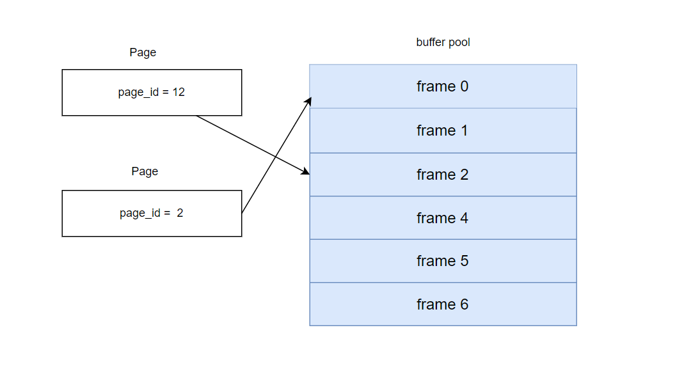

buffer pool是负责在内存和磁盘之间移动页面(数据库文件是以页来组织的)。buffer pool的操作对于系统的其他组件是 透明的，也就是说系统只需要使用一个page_id（这是唯一的）去像buffer pool请求这个页面，是不知道这个页是不是已经在内存中了，还是需要从磁盘中读。

### 可拓展hash table

第一个任务是需要实现一个可拓展hash table，这个hash table的作用是负责管理page_id到buffer pool中页面id(frame_id)的映射。buffer pool管理N个页面的内存空间，一个页面的内存空间就叫做frame。需要读取一个页面时，就将一个frame分配这个页面，然后用hash table记录这个映射关系。

在实现之前需要理解一些可拓展哈希表中的概念：[参考文献]([Extendible Hashing (Dynamic approach to DBMS) - GeeksforGeeks](https://www.geeksforgeeks.org/extendible-hashing-dynamic-approach-to-dbms/))

- **目录dir**：这个容器存储指向桶的指针。每个dir给定一个唯一的id，当扩张发生时`id`可能随之改变。哈希函数返回这个目录的id，这个`id`被用来指向合适的桶。dir的数量 = 2^{全局深度}
- **桶:** 存储哈希键。目录指向桶。如果局部深度小于全局深度时，一个桶可能包含不止一个指针指向它。
- **全局深度**：它跟目录相关联。它们表示哈希函数使用的比特位数目去分类这些键。全局深度=目录id的比特位数
- **局部深度**：和全局深度类似，局部深度是跟桶关联，而不是跟目录。当桶溢出发生时，局部深度根据全局深度去决定执行的行为。局部深度通常小于等于全局深度。
- **桶分裂**：当桶的元素超过了特定的大小，那么桶分裂成两个部分。
- **目录扩容**：当桶溢出时，可能会有目录扩容。当溢出桶的局部深度等于全局深度时，目录扩容被执行。

首先需要实现的是Bucket，Bucket采用的std::list<pair<K,V>>来作为存储数据的数据结构，stl可以让我们很方便的实现数据的增删查改。查找一个key可以通过std::find_if或者遍历这个list，插入时需要判断是否超出这个桶的大小。

有了Bucket，就可以开始实现我们的可拓展hash表，它的全局深度首先被初始化为0，由于桶的数量是2^全局深度，所以在开始时只有一个桶，即dir中只有一个Bucket指针。

重点是insert操作(插入一个key，value对)的实现。首先是根据hash函数计算出key的dir index，然后再在对应的桶中实现插入。在插入到桶中时可能因为桶已满而插入失败，这时候我们就需要进行目录扩张和桶分裂。需要注意的是：并不是桶满了就需要执行目录的分裂，而是当桶的局部深度=全局深度时，才需要进行桶的分裂。在桶的局部深度小于全局深度时是不需要扩张目录的，此时是有多个指针指向同一个桶，我们只需要再创建一个新桶，然后再将这个已满桶中的元素重新分配即可，创建新桶需要将局部深度+1。在桶扩张时，将新扩张的dir(桶指针)指向同一个桶，当需要时再去创建新的桶。

eg:  global_depth = 2, local_depth = 2, dir_size = 2^2 = 4，插入kv到idx = 3 的桶，但这个桶已经满了。则需要执行dir扩张，扩张为原来的2倍，即dir_size = 2^2* << 1,扩张为8。idx = 3 = 011，3 + old_dir_size = 7 = 111，7的位置则是新建的桶。其他新扩张应该指向之前的桶，等到之间的桶满，再创建。即4指向0指向的桶，等等。

由于是要支持并发操作的，因此也需要在合适的地方加锁。

造成死锁的一种情况：当一个函数中已经加锁再去调用另一个需要同一把锁的函数，这会造成死锁。

### lru_k替换策略

在frame中page，在整个buffer pool中的所有frame都被使用时，这时候则需要选择一个victim来替换。常使用的是lru算法，lru_k则是再lru的基础上多加了一个访问k次以上的页，是要比那些小于k次更晚被换出。简单的理解就是，将所有在frame中的页面分为访问小于k次的和大于等于k次的，两种都是采用lru算法，但是是先替换小于k次的页面，小于k次页面的全部不能被替换或者当没有小于k次还需要Evict一个page时，才去Evict一个大于k次的页面。

不能被替换的page是那些被pin的，也就是还在使用的page。

`std::vector<LRUKFrameRecord *> frames_` 记录buffer pool中所有frame的一个访问记录，`LRUKFrameRecord` 是记录一个frame的最多k次访问记录。

我们可以set来将所有可被Evict的frame分为小于k次的一个set，和大于等于k次的一个set，并且重载`LRUKFrameRecord` 的operator<，使其访问时间最早的在set的最前面，Evict时则选择set.begind()的frame。不可被Evict的frame不应该出现在set中，不能被lru的机制所Evict。

SetEvictable这个函数将一个frame设置为可不可被Evict, 一种情况是将不可被Evict设置为可Evict，需要再对应的set中加入；一种是可Evict设置为不可Evict，需要将其在对应的set中移除。

### buffer_pool_manager_instance

bpm则将上面实现的组件协同起来实现整个buffer_pool的逻辑。

bpm管理着一个`std::list<frame_id_t> free_list_`, 记录着未被使用的frame，free_list_为空时，则需要用lru_k替换一个frame。

NewPgImp需要在buffer pool中创建page_id的page，如果free_list_为空时，则需要用lru_k替换一个frame。替换这个frame如果他的状态是dirty的，则需要调用disk_manager将其写回。创建新page后，需要用hash table记录其对应的frame，以及需要记录访问记录以上lru_k替换器来管理。

FetchPgImp在buffer  pool中获取指定page_id的页面，存在则直接获取，同时记录访问和pin++,并且设置不可Evict。若不存在，则需要像newPage一样。

fetch 和 newpage的区别是：new是在buffer pool中加入一个新的页面，而fetch是获得在buffer pool中已有的页面,没有再尝试evict a frame and read page_id page from disk