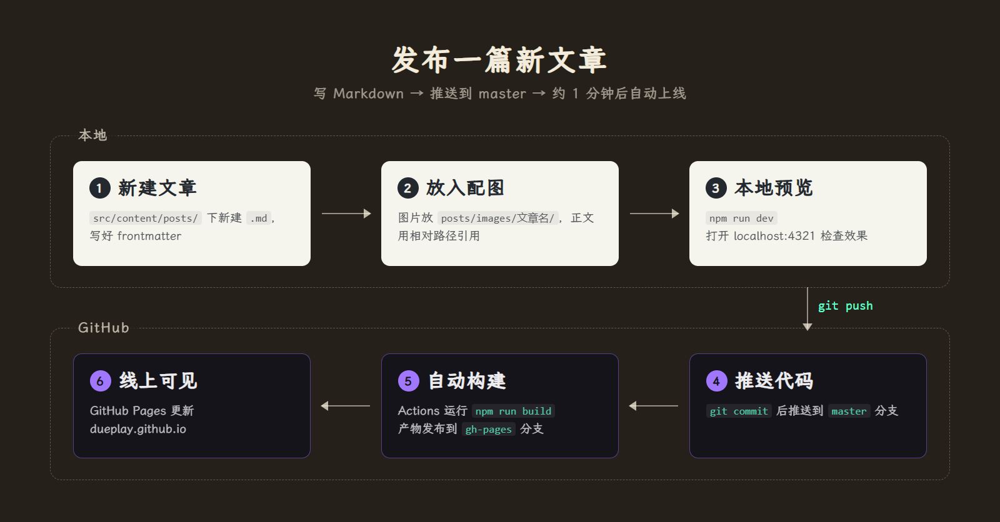

这个博客没有后台，也没有数据库，每篇文章就是仓库里的一个 Markdown 文件。写完推送到 GitHub，大约一分钟后就会出现在线上。整个流程如下：



## 第一步：新建文章

在 `src/content/posts/` 目录下新建一个 `.md` 文件。**文件名就是文章的链接**，比如 `raft-notes.md` 发布后的地址是 `/posts/raft-notes/`，所以建议用简短的英文、数字和连字符命名。

文件开头写上 frontmatter：

```yaml
---
title: Raft 论文笔记
date: 2026-10-08
description: 首页列表和搜索里显示的摘要
categories: [Distributed System]
slogan: 顶部横幅显示的一句话
draft: false
---
```

其中 `title` 和 `date` 必填，其余可以省略：

| 字段 | 说明 |
| --- | --- |
| `title` | 文章标题 |
| `date` | 发布日期，首页按它从新到旧排序；同一天有多篇时可以带上时间，如 `2026-10-08T20:00:00+08:00` |
| `description` | 摘要，不填则自动截取正文开头 |
| `categories` | 分类，显示在标题下方 |
| `slogan` | 文章页顶部横幅的标语，不填用站点默认 |
| `draft` | 设为 `true` 时只在本地预览可见，不会发布 |

frontmatter 之后就是正文，从二级标题 `##` 开始写，一级标题留给文章标题。二、三级标题有 5 个及以上时，宽屏下右侧会自动出现目录。

## 第二步：放入配图

图片和文章放在一起，按文章名分目录：

```
src/content/posts/
├── raft-notes.md
└── images/
    └── raft-notes/
        └── leader-election.png
```

正文里用相对路径引用：

```markdown

```

这样做有几个好处：构建时图片会自动压缩成 webp 并懒加载；在 Typora 或 VS Code 里写作时本地预览就能看到图；路径写错会直接构建失败，不会把坏图发到线上。方括号里的文字会作为图片说明，点击图片放大时显示在底部。

如果用 Typora，可以在「偏好设置 → 图像 → 插入图片时」选择「复制图片到指定路径」，填入 `./images/${filename}`，以后粘贴截图就会自动存到对应目录。

## 第三步：本地预览

第一次在这台电脑上写，先安装依赖：

```bash
npm install
```

之后每次启动预览服务器：

```bash
npm run dev
```

打开 <http://localhost:4321>，保存文件后页面会自动刷新。重点看一下标题、代码块、图片和目录是否正常。`draft: true` 的草稿只会在这里出现。

如果想确认正式构建也没问题，可以再跑一次：

```bash
npm run build
```

## 第四步：推送到 GitHub

确认无误后提交并推送到 `master` 分支：

```bash
git add src/content/posts
git commit -m "Add post: Raft 论文笔记"
git push origin master
```

网络不稳定导致推送失败时，重新执行一次 `git push` 即可。

## 第五步：自动构建与上线

推送之后就不需要再做什么了。GitHub Actions 会自动：

1. 安装依赖并执行 `npm run build`，生成整站静态页面；
2. 把构建产物发布到 `gh-pages` 分支；
3. GitHub Pages 从 `gh-pages` 分支更新线上站点。

整个过程大约一分钟，可以在仓库的 [Actions 页面](https://github.com/Dueplay/Dueplay.github.io/actions) 查看进度，出现绿色的对勾就说明已经上线。新文章会同时出现在首页、搜索和 RSS 里；第一次有读者评论时，评论区会自动在仓库的 Discussions 中创建对应的讨论帖。

## 常见问题

**Actions 显示构建失败？** 点进失败的任务查看日志，最常见的原因是图片路径写错或 frontmatter 缺少 `title`、`date`。本地先跑一遍 `npm run build` 能提前发现这类问题。

**已经上线但浏览器里还是旧内容？** GitHub Pages 页面会被缓存几分钟，按 <kbd>Ctrl</kbd> + <kbd>F5</kbd> 强制刷新即可。

**想修改或删除已发布的文章？** 直接改动或删除对应的 `.md` 文件，再走一遍第四步。注意别改文件名，否则文章链接会变，已有的评论也会对不上。
